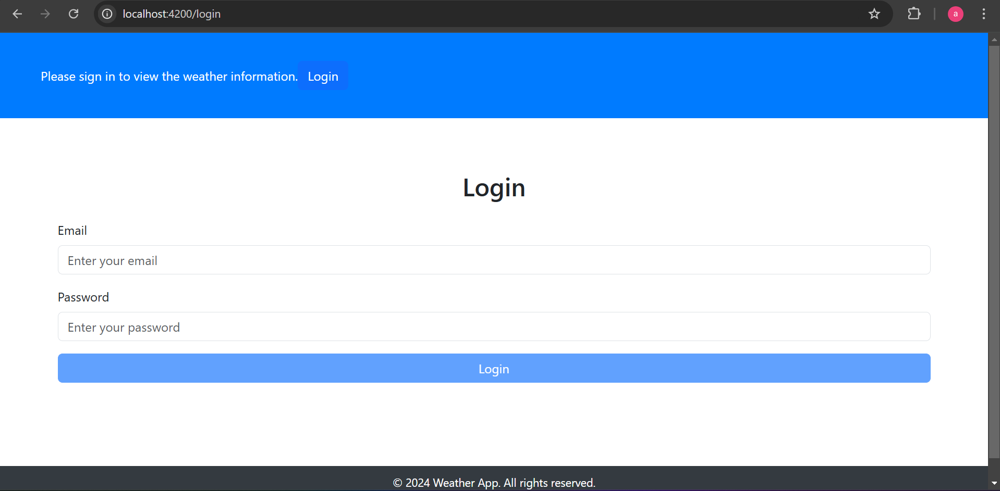

# WeatherSpa

This project was generated with [Angular CLI](https://github.com/angular/angular-cli) version 14.2.13.

# Project Upgradation
Project has been upgraded from angular 14 to angular 17.

## External Packages

- bootstrap
- animations

## Technologies Used

- Angular 14: Framework for building the SPA.
- TypeScript: Typed superset of JavaScript.
- OpenWeatherMap API: Source of weather data.
- Angular Forms: For reactive form handling with validations.
- SCSS: For styling the components.
- Routing: Angular Router to navigate between pages.
- HTTPClientModule: To fetch data from the weather API.

## API

14-Day Forecast API is not available in the free plan, so used
5-Days 3-Hour API instead.

